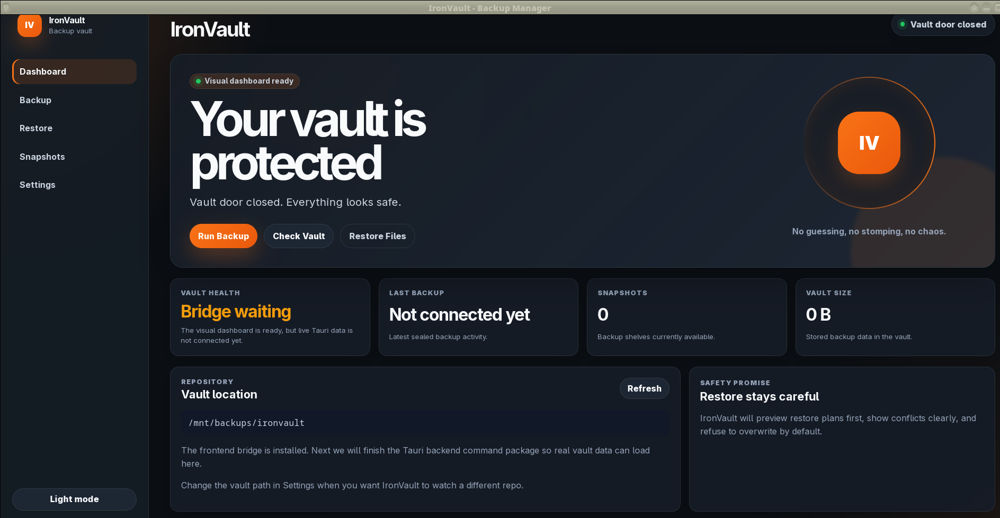
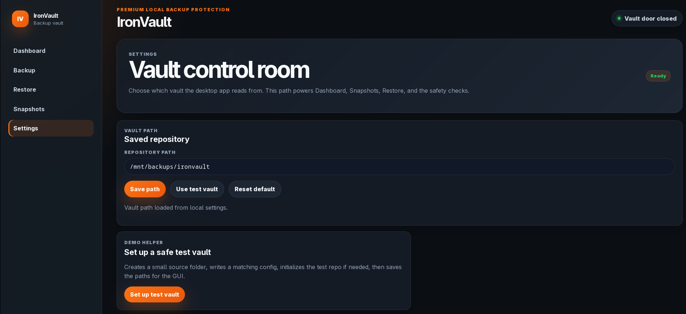
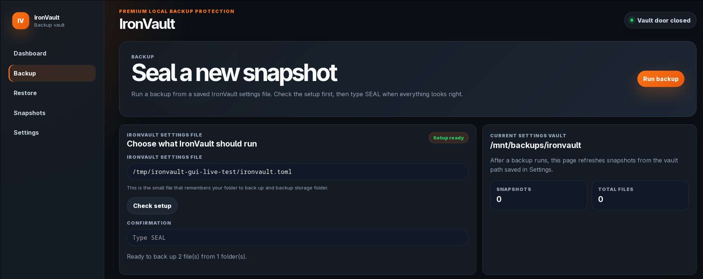
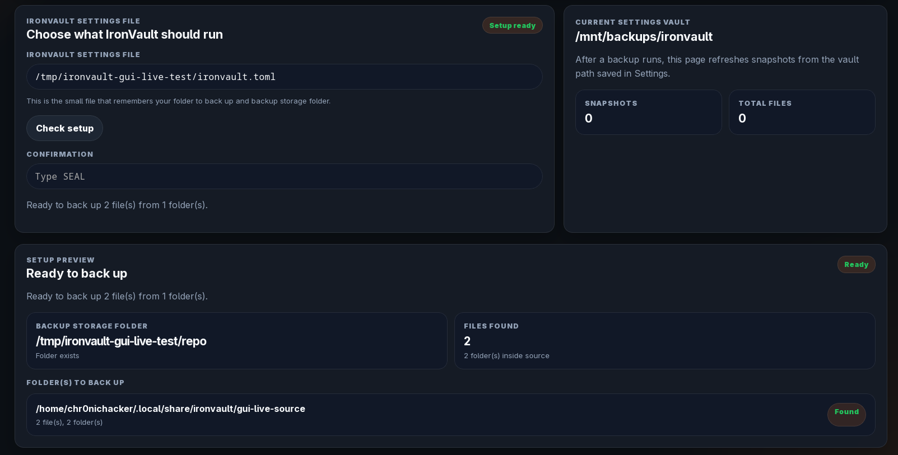
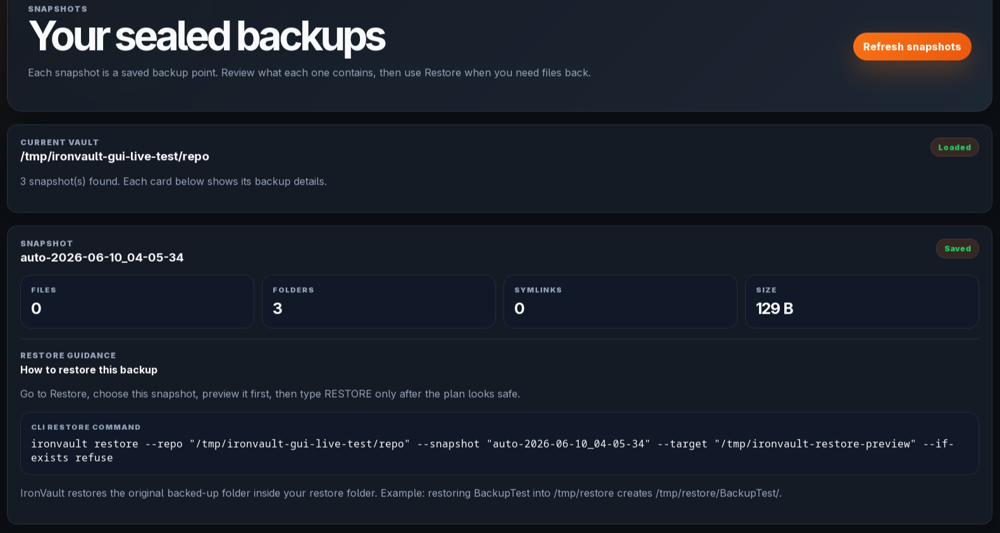
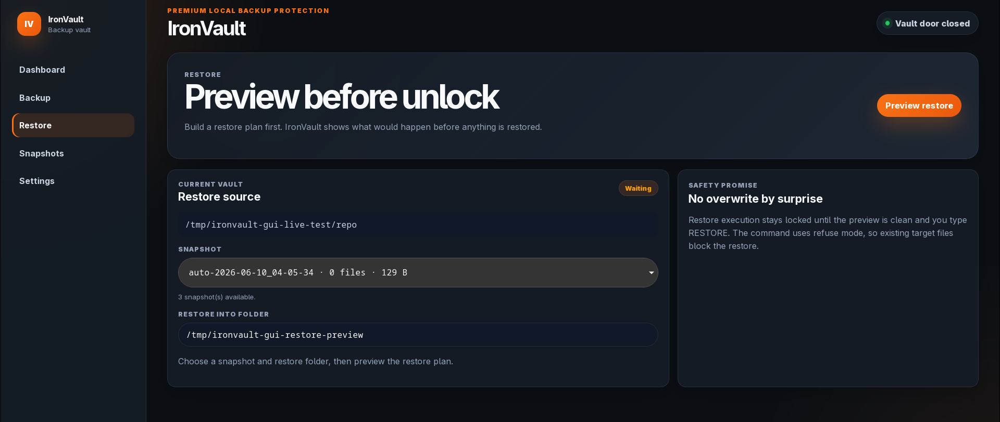

# IronVault

IronVault is a local-first backup tool with a Rust backup core, command-line interface, and desktop GUI.

It is designed around a simple idea: preview what will happen, confirm before anything serious runs, and protect restores from accidental overwrites by default.

IronVault v0.1.0 RC1 includes a working CLI, a Tauri/Vue desktop GUI, backup setup, backup previews, snapshot history, restore previews, guarded restore confirmation, and Linux release builds.

> Status: v0.1.0 RC1. This is a release candidate, not a finished commercial backup product yet.

## Screenshots

### IronVault Dashboard

Check vault health, snapshot count, and backup status at a glance.

### Simple Vault Setup

Choose what to protect, where backups are stored, and where IronVault saves its settings.

### Preview Before Backup

Review files, folders, storage location, and safety checks before sealing a backup.

### Guarded Backup Flow

IronVault requires confirmation before creating a backup, so nothing runs by accident.

### Snapshot History

See saved snapshots with file counts, folder counts, size, and restore guidance.

### Safe Restore Preview

Preview where files will restore before running anything, with overwrite protection by default.

## What IronVault does

IronVault can:

- Initialize a backup repository
- Back up folders into a local vault
- Store backups as deduplicated chunks
- Compress stored data
- List snapshots
- Verify repository integrity
- Preview restores before writing files
- Refuse overwrite restores by default
- Restore files safely into a target folder
- Run from a CLI or desktop GUI

## What is included in v0.1.0 RC1

- Rust backup core
- CLI backup and restore workflow
- Tauri/Vue desktop GUI
- Demo vault setup
- Real vault setup
- Unsafe backup storage guard
- Backup setup preview
- Snapshot detail cards
- Restore preview
- Guarded restore confirmation
- Restore overwrite refusal by default
- Release candidate build script
- Linux release archive

## What is not included yet

IronVault does not have these features yet:

- Native folder picker buttons
- Final installer polish
- Scheduling
- Cloud backup
- Encryption/password UX
- Pruning controls in the GUI
- Automatic external drive mounting
- Windows or macOS release builds

## Quick start on Linux

Download the latest release from:

https://github.com/BenTreder/IronVault/releases

Extract the Linux archive, then run:

    ./ironvault-cli --help
    ./ironvault-gui

If launching the GUI from the release folder, you can point it to the bundled CLI:

    IRONVAULT_CLI="$PWD/ironvault-cli" ./ironvault-gui

## Run from this repository

Build and test the Rust core and CLI:

    cargo check -p ironvault-core -p ironvault-cli
    cargo test -p ironvault-core -p ironvault-cli
    cargo test -p ironvault-cli --test mvp_backup_restore

Build the frontend:

    cd frontend/ironvault-gui
    npm run build

Check the Tauri backend:

    cd src-tauri
    cargo check

Run the release build script:

    scripts/build-release-candidate.sh 0.1.0-rc1

## CLI commands

IronVault currently includes these CLI commands:

- init
- backup
- dry-run
- snapshots
- info
- verify
- restore-plan
- restore
- prune
- compact

Run:

    ironvault-cli --help

## External drive backups

IronVault can store backups on an external HDD.

A good setup is:

- Folder to back up: your local files, such as Documents
- Backup storage folder: a folder on your external drive
- IronVault settings file: a config file in your user config folder

Example:

- Folder to back up: /home/ben/Documents
- Backup storage folder: /run/media/ben/BackupDrive/IronVaultBackups
- Settings file: /home/ben/.config/ironvault/ironvault.toml

Always make sure the external drive is mounted before running a backup.

## Safety notes

IronVault is a backup tool, so test it before trusting it with anything important.

Recommended first test:

1. Create a small test folder.
2. Add a few sample files.
3. Back it up with IronVault.
4. Preview a restore.
5. Restore into a temporary folder.
6. Confirm the files restored correctly.

For important files, keep more than one backup method until IronVault is more mature.

## Project structure

- crates/ironvault-core: backup engine
- crates/ironvault-cli: command-line interface
- frontend/ironvault-gui: Vue frontend
- frontend/ironvault-gui/src-tauri: Tauri desktop backend
- docs: project docs and screenshots
- scripts: release and helper scripts

## Release status

Current public release:

- IronVault v0.1.0 RC1
- Tag: ironvault-v0.1.0-rc1
- Release page: https://github.com/BenTreder/IronVault/releases/tag/ironvault-v0.1.0-rc1

## Built by

Made by Ben Treder.

https://bentreder.com
